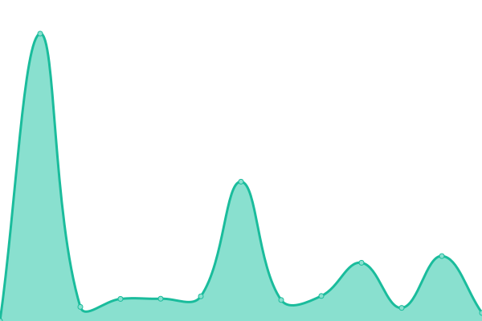

# [📈 Live Status](https://kevinbrechbuehl.github.io/upptime): <!--live status--> **🟩 All systems operational**

This repository contains the open-source uptime monitor and status page for [Kevin Brechbühl](https://kevinbrechbuehl.com), powered by [Upptime](https://github.com/upptime/upptime).

With [Upptime](https://upptime.js.org), you can get your own unlimited and free uptime monitor and status page, powered entirely by a GitHub repository. We use [Issues](https://github.com/kevinbrechbuehl/upptime/issues) as incident reports, [Actions](https://github.com/kevinbrechbuehl/upptime/actions) as uptime monitors, and [Pages](https://kevinbrechbuehl.github.io/upptime) for the status page.

<!--start: status pages-->
<!-- This summary is generated by Upptime (https://github.com/upptime/upptime) -->
<!-- Do not edit this manually, your changes will be overwritten -->
<!-- prettier-ignore -->
| URL | Status | History | Response Time | Uptime |
| --- | ------ | ------- | ------------- | ------ |
|  [kevinbrechbuehl.ch](https://kevinbrechbuehl.ch) | 🟩 Up | [kevinbrechbuehl-ch.yml](https://github.com/kevinbrechbuehl/upptime/commits/HEAD/history/kevinbrechbuehl-ch.yml) | 

 926ms
     
 | 

<a href="https://kevinbrechbuehl.github.io/upptime/history/kevinbrechbuehl-ch">99.32%</a>
    

|  [kevinbrechbuehl.com](https://kevinbrechbuehl.com) | 🟩 Up | [kevinbrechbuehl-com.yml](https://github.com/kevinbrechbuehl/upptime/commits/HEAD/history/kevinbrechbuehl-com.yml) | 

 969ms
     
 | 

<a href="https://kevinbrechbuehl.github.io/upptime/history/kevinbrechbuehl-com">99.43%</a>
    

|  [aquasonic.ch](https://aquasonic.ch) | 🟩 Up | [aquasonic-ch.yml](https://github.com/kevinbrechbuehl/upptime/commits/HEAD/history/aquasonic-ch.yml) | 

 755ms
     
 | 

<a href="https://kevinbrechbuehl.github.io/upptime/history/aquasonic-ch">99.44%</a>
    

|  [Blog](https://ctor.io) | 🟩 Up | [blog.yml](https://github.com/kevinbrechbuehl/upptime/commits/HEAD/history/blog.yml) | 

 142ms
     
 | 

<a href="https://kevinbrechbuehl.github.io/upptime/history/blog">99.85%</a>
    

|  [My Fuel](https://myfuel.ctor.io) | 🟩 Up | [my-fuel.yml](https://github.com/kevinbrechbuehl/upptime/commits/HEAD/history/my-fuel.yml) | 

 130ms
     
 | 

<a href="https://kevinbrechbuehl.github.io/upptime/history/my-fuel">99.85%</a>
    

|  [My Home](https://myhome.ctor.io) | 🟩 Up | [my-home.yml](https://github.com/kevinbrechbuehl/upptime/commits/HEAD/history/my-home.yml) | 

 176ms
     
 | 

<a href="https://kevinbrechbuehl.github.io/upptime/history/my-home">100.00%</a>
    

|  [Coiffeur Cocoon](https://www.coiffeur-cocoon.ch) | 🟩 Up | [coiffeur-cocoon.yml](https://github.com/kevinbrechbuehl/upptime/commits/HEAD/history/coiffeur-cocoon.yml) | 

 783ms
     
 | 

<a href="https://kevinbrechbuehl.github.io/upptime/history/coiffeur-cocoon">100.00%</a>
    

|  [Coiffeur Cocoon Api](https://api.coiffeur-cocoon.ch) | 🟩 Up | [coiffeur-cocoon-api.yml](https://github.com/kevinbrechbuehl/upptime/commits/HEAD/history/coiffeur-cocoon-api.yml) | 

 535ms
     
 | 

<a href="https://kevinbrechbuehl.github.io/upptime/history/coiffeur-cocoon-api">100.00%</a>
    

|  [Coiffeur Cocoon Booking](https://my.calenso.com/book/coiffeur-cocoon) | 🟩 Up | [coiffeur-cocoon-booking.yml](https://github.com/kevinbrechbuehl/upptime/commits/HEAD/history/coiffeur-cocoon-booking.yml) | 

 1219ms
     
 | 

<a href="https://kevinbrechbuehl.github.io/upptime/history/coiffeur-cocoon-booking">100.00%</a>
    

<!--end: status pages-->

[**Visit our status website →**](https://kevinbrechbuehl.github.io/upptime)

## 📄 License

- Powered by: [Upptime](https://github.com/upptime/upptime)
- Code: [MIT](./LICENSE) © [Kevin Brechbühl](https://kevinbrechbuehl.com)
- Data in the `./history` directory: [Open Database License](https://opendatacommons.org/licenses/odbl/1-0/)
