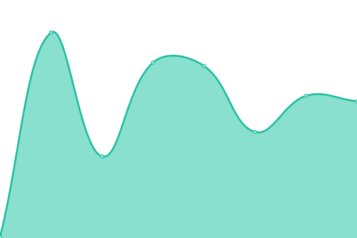

# [📈 Live Status](https://kevinbrechbuehl.github.io/upptime): <!--live status--> **🟩 All systems operational**

This repository contains the open-source uptime monitor and status page for [Kevin Brechbühl](https://kevinbrechbuehl.com), powered by [Upptime](https://github.com/upptime/upptime).

With [Upptime](https://upptime.js.org), you can get your own unlimited and free uptime monitor and status page, powered entirely by a GitHub repository. We use [Issues](https://github.com/kevinbrechbuehl/upptime/issues) as incident reports, [Actions](https://github.com/kevinbrechbuehl/upptime/actions) as uptime monitors, and [Pages](https://kevinbrechbuehl.github.io/upptime) for the status page.

<!--start: status pages-->
<!-- This summary is generated by Upptime (https://github.com/upptime/upptime) -->
<!-- Do not edit this manually, your changes will be overwritten -->
<!-- prettier-ignore -->
| URL | Status | History | Response Time | Uptime |
| --- | ------ | ------- | ------------- | ------ |
|  [kevinbrechbuehl.ch](https://kevinbrechbuehl.ch) | 🟩 Up | [kevinbrechbuehl-ch.yml](https://github.com/kevinbrechbuehl/upptime/commits/HEAD/history/kevinbrechbuehl-ch.yml) | 

 664ms
     
 | 

<a href="https://kevinbrechbuehl.github.io/upptime/history/kevinbrechbuehl-ch">99.78%</a>
    

|  [kevinbrechbuehl.com](https://kevinbrechbuehl.com) | 🟩 Up | [kevinbrechbuehl-com.yml](https://github.com/kevinbrechbuehl/upptime/commits/HEAD/history/kevinbrechbuehl-com.yml) | 

 713ms
     
 | 

<a href="https://kevinbrechbuehl.github.io/upptime/history/kevinbrechbuehl-com">99.78%</a>
    

|  [aquasonic.ch](https://aquasonic.ch) | 🟩 Up | [aquasonic-ch.yml](https://github.com/kevinbrechbuehl/upptime/commits/HEAD/history/aquasonic-ch.yml) | 

 1042ms
     
 | 

<a href="https://kevinbrechbuehl.github.io/upptime/history/aquasonic-ch">99.79%</a>
    

|  [Curriculum Vitae](https://cv.kevinbrechbuehl.ch) | 🟩 Up | [curriculum-vitae.yml](https://github.com/kevinbrechbuehl/upptime/commits/HEAD/history/curriculum-vitae.yml) | 

 1603ms
     
 | 

<a href="https://kevinbrechbuehl.github.io/upptime/history/curriculum-vitae">100.00%</a>
    

|  [My Fuel](https://myfuel.yunu.ch) | 🟩 Up | [my-fuel.yml](https://github.com/kevinbrechbuehl/upptime/commits/HEAD/history/my-fuel.yml) | 

 278ms
     
 | 

<a href="https://kevinbrechbuehl.github.io/upptime/history/my-fuel">100.00%</a>
    

|  [Coiffeur Cocoon](https://www.coiffeur-cocoon.ch) | 🟩 Up | [coiffeur-cocoon.yml](https://github.com/kevinbrechbuehl/upptime/commits/HEAD/history/coiffeur-cocoon.yml) | 

 1364ms
     
 | 

<a href="https://kevinbrechbuehl.github.io/upptime/history/coiffeur-cocoon">99.79%</a>
    

|  [Coiffeur Cocoon Api](https://api.coiffeur-cocoon.ch) | 🟩 Up | [coiffeur-cocoon-api.yml](https://github.com/kevinbrechbuehl/upptime/commits/HEAD/history/coiffeur-cocoon-api.yml) | 

 1237ms
     
 | 

<a href="https://kevinbrechbuehl.github.io/upptime/history/coiffeur-cocoon-api">99.80%</a>
    

|  [Coiffeur Cocoon Booking](https://book.calenso.com/coiffeur-cocoon) | 🟩 Up | [coiffeur-cocoon-booking.yml](https://github.com/kevinbrechbuehl/upptime/commits/HEAD/history/coiffeur-cocoon-booking.yml) | 

 1322ms
     
 | 

<a href="https://kevinbrechbuehl.github.io/upptime/history/coiffeur-cocoon-booking">100.00%</a>
    

|  [Yunu](https://yunu.ch) | 🟩 Up | [yunu.yml](https://github.com/kevinbrechbuehl/upptime/commits/HEAD/history/yunu.yml) | 

 55ms
     
 | 

<a href="https://kevinbrechbuehl.github.io/upptime/history/yunu">100.00%</a>
    

|  [Yunu Url Shortener](https://go.yunu.ch/home) | 🟩 Up | [yunu-url-shortener.yml](https://github.com/kevinbrechbuehl/upptime/commits/HEAD/history/yunu-url-shortener.yml) | 

 438ms
     
 | 

<a href="https://kevinbrechbuehl.github.io/upptime/history/yunu-url-shortener">99.80%</a>
    

|  [Yunu Privacy Policy](https://www.privacybee.ch/v/clrcgci7i001gwm303kpeul4z?lang=de) | 🟩 Up | [yunu-privacy-policy.yml](https://github.com/kevinbrechbuehl/upptime/commits/HEAD/history/yunu-privacy-policy.yml) | 

 2330ms
     
 | 

<a href="https://kevinbrechbuehl.github.io/upptime/history/yunu-privacy-policy">100.00%</a>
    

<!--end: status pages-->

[**Visit our status website →**](https://kevinbrechbuehl.github.io/upptime)

## 📄 License

- Powered by: [Upptime](https://github.com/upptime/upptime)
- Code: [MIT](./LICENSE) © [Kevin Brechbühl](https://kevinbrechbuehl.com)
- Data in the `./history` directory: [Open Database License](https://opendatacommons.org/licenses/odbl/1-0/)
